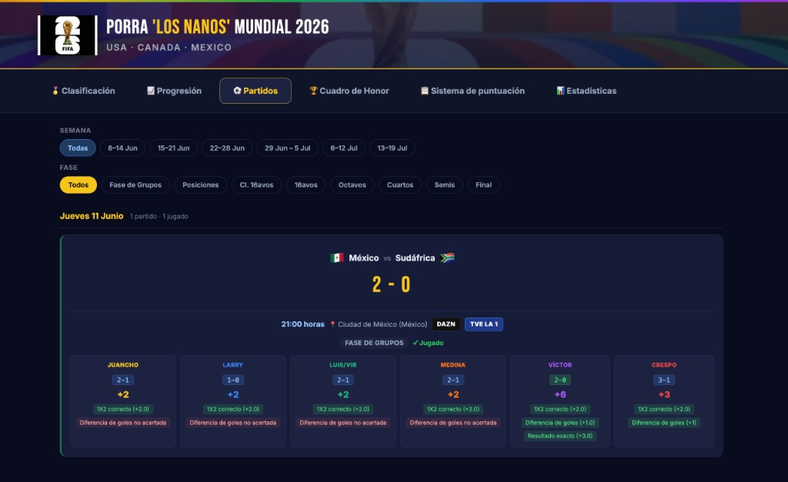

# Porra Mundial «Los Nanos» 2026 — Web interactiva

Dashboard web privado para seguir la porra del **Mundial FIFA 2026** entre 6 amigos. Lee los Excel de administración que ya usáis y los convierte en una interfaz visual, cómoda y actualizada en el navegador.

> **En una frase:** el panel de control de vuestra porra, alimentado automáticamente por los Excel ADMIN, para ver quién va ganando, por qué y cómo evoluciona el torneo — sin tener que abrir el Excel cada vez.



---

## ¿Para qué sirve?

- Ver la **clasificación en tiempo casi real** (sin abrir el Excel)
- Consultar **partidos, pronósticos y puntos** de cada jugador
- Entender **de dónde vienen los puntos** (1X2, diferencia, exacto, fases del torneo…)
- Seguir la **progresión**, **estadísticas**, **fortalezas** y un **pronóstico por tendencia**
- Consultar el **cuadro de honor** (campeón, botas, balones…)
- Tener a mano el **sistema de puntuación** y los **premios** (40 € al 1.º, 20 € al 2.º)

**No sustituye al Excel:** solo lo lee y lo muestra de forma visual. Los resultados y pronósticos siguen gestionándose en los ficheros ADMIN.

---

## Jugadores

| Jugador | Excel |
|---------|-------|
| JUANCHO, LARRY, LUIS/VIR, MEDINA, VÍCTOR | `ADMIN-Excel-Mundial_NANOS_2026 [1].xlsx` |
| Crespo | `ADMIN-Excel-Mundial_NANOS_2026 [2].xlsx` |

---

## Estructura del proyecto

El repositorio vive dentro de la carpeta del Mundial y espera los Excel en el directorio hermano `00. ADMIN/`:

```
Mundial 2026/
├── 00. ADMIN/
│   ├── ADMIN-Excel-Mundial_NANOS_2026 [1].xlsx   ← 5 jugadores + hoja maestra
│   └── ADMIN-Excel-Mundial_NANOS_2026 [2].xlsx   ← Crespo
└── Web_Interactiva_PORRA_NANOS_MUNDIAL_2026/
    ├── index.html                      → Interfaz web (HTML + CSS + JS)
    ├── data.json                       → Datos exportados para GitHub Pages
    ├── app.py                          → Backend Flask local (lee Excel, API JSON)
    ├── build_static.py                 → Genera data.json desde los Excel
    ├── fixture_data.py                 → Sedes y TV de los 104 partidos
    ├── launch.py                       → Arranca servidor + abre Chrome
    ├── RUN - Porra Los Nanos.command   → Doble clic para lanzar todo (macOS)
    ├── static/                         → Logo WC 2026, favicon, fondos
    └── docs/
        └── screenshot-partidos.png     → Captura de ejemplo
```

---

## Fuentes de datos

### Excel ADMIN (fuente principal)

| Hoja | Qué extrae el backend |
|------|------------------------|
| **ADMIN** | Pronósticos y puntuación por partido (columna de cada jugador) |
| **CLAS** | Clasificación total y desglose por fase (grupos, posiciones, KO, honor…) |
| **WORLDCUP** | Horarios en hora España, banderas, equipos, resultados reales |

### Dónde meter los resultados en el Excel

| Dato | Hoja | Ubicación |
|------|------|-----------|
| Goles local / visitante | WORLDCUP | Columnas **AC** y **AD** |
| Clasificación | CLAS | Calculada por las fórmulas del Excel |
| Pronósticos | ADMIN | Columna de cada jugador |

### `fixture_data.py` (complementario)

Sedes (ciudad + país) y emisión TV en España (**DAZN** / **TVE La 1**) de los 104 partidos.  
Fuentes: calendario FIFA + calendario TV España. **No viene del Excel.**

---

## Pestañas

### Clasificación

- Banner de premios (40 € / 20 €)
- Podio olímpico con top 3
- Tabla completa desglosada por fases
- **Fortalezas** de cada jugador: rankings por habilidad con badges como *Francotirador*, *Rey del 1X2*, *Estratega de grupos*, *Maestro KO*…

### Progresión

- Gráfica de puntos acumulados día a día (hora España)
- Mini tarjetas por jugador con el delta del último día

### Partidos

- Partidos agrupados por día, con filtros por **semana** y **fase**
- Cabecera con banderas, resultado, hora (ej. 21:00 horas), sede y TV
- Desglose de puntos por jugador (chips verdes / rojos)
- Auto-scroll al día de hoy al abrir la pestaña

### Cuadro de Honor

- Campeón, subcampeón, 3.º, botas de oro/plata/bronce, balones de oro/plata/bronce
- Pronósticos de cada jugador vs. resultado real (cuando exista)

### Sistema de puntuación

- Reglas extraídas del Excel (basado en Matejero)
- Fase de grupos: 1X2 + diferencia + exacto (máx. 6 pts/partido)
- Puntos por fase: posiciones, clasificados, eliminatorias, honor…

### Estadísticas

- Pronóstico por tendencia: líder actual, mejor ritmo del último día, proyección al cierre de grupos
- Gráficas de tasa de acierto y distribución por fase
- Tarjetas detalladas por jugador

---

## Sistema de puntuación (fase de grupos)

Por cada partido jugado, un jugador puede sumar:

| Criterio | Puntos típicos |
|----------|----------------|
| Signo 1X2 (local / empate / visitante) | 2 pts |
| Diferencia de goles *(si acertó 1X2)* | 1 pt |
| Resultado exacto | 3 pts |
| **Máximo teórico** | **6 pts** |

Además hay puntos por posiciones de grupos, clasificados a 16avos, partidos KO, final, cuadro de honor, etc., tal como define el Excel ADMIN.

---

## Arquitectura técnica

| Capa | Tecnología |
|------|------------|
| Backend | Python 3 + **Flask** + **openpyxl** |
| Frontend | HTML + **Tailwind CSS** + **Chart.js** (SPA de una sola página con pestañas) |
| Puerto | `5050` |
| URL | [http://localhost:5050](http://localhost:5050) |
| Caché | 30 segundos (no relee el Excel en cada F5) |

### API

| Endpoint | Descripción |
|----------|-------------|
| `GET /` | Interfaz web |
| `GET /api/data` | JSON con clasificación, partidos, progresión, honor, estadísticas… |
| `GET /api/refresh` | Fuerza recarga de caché (invalida los 30 s) |

La web **no escribe** en el Excel: solo lectura. Si Excel está abierto y bloquea el fichero, la carga puede fallar.

---

## Requisitos

- **macOS** (el script `.command` y la apertura automática de Chrome están pensados para Mac)
- **Python 3**
- Dependencias Python:

```bash
pip install flask openpyxl
```

---

## Cómo arrancarla

### Opción 1 — Doble clic (recomendado)

Haz doble clic en **`RUN - Porra Los Nanos.command`**. El script:

1. Comprueba que existen los dos Excel en `00. ADMIN/`
2. Mata cualquier servidor viejo en el puerto 5050
3. Arranca Flask y abre Chrome en [http://localhost:5050](http://localhost:5050)

### Opción 2 — Manual

```bash
cd Web_Interactiva_PORRA_NANOS_MUNDIAL_2026
python3 launch.py
```

Para detener el servidor: **Ctrl+C** en la terminal, o cierra la ventana del `.command`.

---

## GitHub Pages (versión online)

GitHub Pages **no puede ejecutar Python/Flask**; solo sirve archivos estáticos. Por eso la versión online usa `index.html` + `data.json` en la raíz del repositorio.

**URL:** [https://pcresp0.github.io/porra-mundial-nanos-2026/](https://pcresp0.github.io/porra-mundial-nanos-2026/)

### Configuración en GitHub

En el repositorio → **Settings** → **Pages** → Source: **Deploy from a branch** → Branch: **main** → Folder: **/ (root)**.

### Actualizar la web online tras cambiar el Excel

```bash
python3 build_static.py    # regenera data.json desde los Excel
git add data.json
git commit -m "Actualizar datos de la porra"
git push origin main
```

GitHub Pages tarda 1–2 minutos en publicar los cambios. La versión online **no lee el Excel en vivo**: muestra el snapshot de `data.json` que subas al repo.

---

## Flujo de trabajo habitual

1. Metéis resultados en el Excel ADMIN (**WORLDCUP**, columnas AC/AD)
2. El Excel recalcula **CLAS** y las puntuaciones
3. **Local:** recargáis la web (**F5**) → se actualiza sola (caché máx. 30 s)
4. **GitHub Pages:** ejecutáis `python3 build_static.py` y subís el `data.json` nuevo
5. Consultáis clasificación, partidos, stats, etc.

---

## Diseño

- Tema oscuro estilo Mundial 2026 (dorado, azul noche)
- Logo oficial WC 2026 en cabecera y favicon
- Cabecera: **PORRA 'LOS NANOS' MUNDIAL 2026** · USA · CANADA · MEXICO
- Responsive (móvil y escritorio)

---

## Limitaciones

- **Local** (`localhost:5050`): lee el Excel en vivo; necesita Python y los ficheros en `00. ADMIN/`
- **GitHub Pages**: solo muestra el último `data.json` subido al repo (no lee Excel directamente)
- Depende de que los Excel estén en `00. ADMIN/` con **esos nombres exactos** (solo para uso local y para generar `data.json`)
- Sedes y TV vienen de `fixture_data.py`, no del Excel
- Con pocos partidos jugados, el pronóstico por tendencia y las fortalezas son **orientativos**
- Si el Excel da error (fórmulas rotas, archivo abierto), la web muestra error y botón de reintentar

---

## Créditos

Web desarrollada por **Pablo Crespo**

- [LinkedIn](https://www.linkedin.com/in/pablocrespobellido/)
- [Twitter / X](https://x.com/CrespoToTheWild)

---

*Mundial FIFA 2026 · USA · CANADA · MEXICO*
