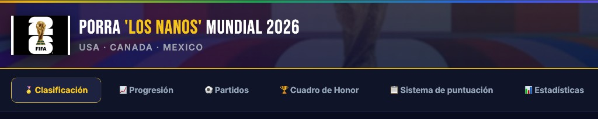

<p align="center">
  
</p>

<h1 align="center">Porra Mundial «Los Nanos» 2026</h1>

<p align="center">
  <strong>Dashboard web interactivo para seguir una porra privada del Mundial FIFA 2026</strong><br>
  <a href="https://pcresp0.github.io/porra-mundial-nanos-2026/">🌐 Demo en vivo</a>
  &nbsp;·&nbsp;
  <a href="docs/screenshot-partidos.png">📸 Capturas</a>
</p>

<p align="center">
  
  
  
  
  
</p>

---

## ¿Qué es esto?

Un dashboard web construido **a mano** (sin frameworks de frontend) para seguir una porra de 6 participantes del Mundial FIFA 2026. Lee los pronósticos de un Excel ADMIN, obtiene resultados reales de una API pública y actualiza la web automáticamente tras cada partido mediante GitHub Actions.

**Dos modos de ejecución que comparten la misma interfaz:**
- **Local (dev):** Flask sirve los datos en caliente desde el Excel en `localhost:5050`
- **Producción:** GitHub Pages sirve `index.html` + `data.json` estático — sin servidor

---

## Demo

🔗 **[https://pcresp0.github.io/porra-mundial-nanos-2026/](https://pcresp0.github.io/porra-mundial-nanos-2026/)**

---

## Dos modos de acceso

La misma web se sirve en dos «modos» según el enlace con el que se entre. El modo elegido se recuerda en el navegador (`localStorage`).

| Modo | Enlace | Qué se ve |
|------|--------|-----------|
| 🟡 **Porra** | `…/?porra=1312` | Todo: pronósticos por jugador, puntos, clasificación de la porra, progresión, estadísticas, cuadro de honor, sistema de puntuación y apuestas |
| 🌍 **Público** | `…/` ó `…/?publico=1` | Solo datos del Mundial: partidos y resultados, grupos, goleadores, clasificación general, terceros y fase final. Sin datos de la porra |

- En **modo público**, el menú ofrece accesos directos a *Grupos · Goleadores · Clasificación general · Terceros · Fase Final* (sin submenús) y el título muestra «MUNDIAL FIFA 2026».
- El parámetro `?porra=1312` se limpia de la URL tras cargar; es solo enrutado de interfaz (UX), **no** un control de seguridad: `data.json` es público y contiene los pronósticos.

---

## Características

| Pestaña | Contenido | Modo |
|---------|-----------|------|
| ⚽ **Partidos** | Todos los partidos filtrados por semana/fase; pronósticos por jugador con desglose de puntos; goleadores con indicadores PP (propia puerta) y penalty; marcador y puntos provisionales en tiempo real durante el partido | Ambos (pronósticos solo en porra) |
| 📅 **Calendario** | Vista por día con cuenta atrás al próximo partido; filtro por mes; información de sede y TV | Ambos |
| 📊 **Clasificaciones Mundial** | Grupos, goleadores, clasificación general, terceros y fase final, calculados en directo desde los resultados | Ambos |
| 🏅 **Clasificación porra** | Podio animado, tabla completa ordenable por columna, fortalezas y badges por jugador; clasificación provisional durante el partido en juego | Solo porra |
| 📈 **Progresión** | Gráfica de puntos acumulados día a día; proyección al final de la fase | Solo porra |
| 📊 **Estadísticas** | Tasa de acierto ordenada (partidos con ≥1 pt); evolución acumulada partido a partido; desglose de aciertos; ficha individual por jugador; ranking de partidos más acertados en conjunto | Solo porra |
| 🏆 **Cuadro de Honor** | Campeón, botas de oro, balón de oro y demás apuestas especiales vs. realidad | Solo porra |
| 📋 **Sistema de puntuación** | Reglas completas extraídas del Excel, con fechas límite | Solo porra |
| 🛠️ **Sobre la web** | Arquitectura, stack técnico, ficheros clave, automatización y flujo CI explicado | Ambos |

---

## Arquitectura

```
┌──────────────────────────────────────────────────────────────────┐
│                   index.html  +  static/                         │
│   Vanilla JS (ES2020) · CSS custom props · Chart.js · Leaflet    │
└─────────────────────────┬────────────────────────────────────────┘
                          │  GET /api/data  ó  GET data.json
          ┌───────────────┴───────────────┐
          ▼                               ▼
  ┌──────────────┐                ┌───────────────┐
  │  Flask 3.x   │                │ GitHub Pages  │
  │ localhost:5050│               │   (estático)  │
  └──────┬───────┘                └───────┬───────┘
         │                                │
         └──────────────┬─────────────────┘
                        ▼
           ┌─────────────────────────┐
           │  app.py  ·  build_data()│   ← lógica de puntos,
           │  openpyxl → JSON        │     standings, live
           └────────────┬────────────┘
                        ▼
           ┌─────────────────────────┐
           │   data/*.xlsx  (×2)     │   ← fuente de verdad
           │   data/scorers.json     │   ← goleadores por partido
           │   data/live.json        │   ← partidos en juego ahora
           └─────────────────────────┘
```

### Pipeline de actualización automática (GitHub Actions)

Cada 5 minutos el cron se activa, pero `should_update.py` decide si hay trabajo real:

```
should_update.py  ──► ¿hay partido en juego o recién terminado sin resultado?
        │                         (si no → fin, sin commits)
        ▼
fetch_results.py  ──► API worldcup26.ir → parsea goles (OG, penalti) →
                       escribe scorers.json + live.json + Excel (cirugía XML)
        ▼
excel_sync.py     ──► sincroniza Excel ADMIN
        ▼
build_static.py   ──► recalcula puntos en Python → genera data.json
        ▼
git push          ──► GitHub Pages publica automáticamente
```

> **Por qué se recalculan los puntos en Python:** al escribir los goles directamente en el `.xlsx` el motor de fórmulas de Excel no se ejecuta. `app.py::_score_breakdown()` recalcula 1X2, diferencia y resultado exacto para que la actualización sea 100 % automática.

---

## Stack técnico

| Capa | Tecnología |
|------|-----------|
| **Frontend** | HTML5, CSS nativo (custom properties + keyframes), JS vanilla ES2020 |
| **Gráficas** | Chart.js (CDN) |
| **Mapas** | Leaflet (CDN) |
| **Utilidades CSS** | Tailwind CDN (solo como helper, el diseño es CSS propio) |
| **Tipografía** | Bebas Neue (Google Fonts) |
| **Backend dev** | Python 3.11, Flask 3.x |
| **Lectura Excel** | openpyxl |
| **Producción** | GitHub Pages (estático, sin servidor) |
| **CI / Automatización** | GitHub Actions — cron `*/5 * * * *` |
| **API resultados** | [worldcup26.ir/get/games](https://worldcup26.ir/get/games) (pública, sin clave) |
| **API resúmenes** | YouTube Data API v3 (canal DAZN ES) |
| **API jugadores** | TheSportsDB (pública, sin clave) |

---

## Estructura del repositorio

```
porra-mundial-nanos-2026/
├── index.html              # SPA — toda la UI en un solo fichero
├── data.json               # Snapshot estático para GitHub Pages
├── app.py                  # Flask + build_data() + _score_breakdown()
├── build_static.py         # Genera data.json y hace git push
├── fetch_results.py        # API → parsea goles → scorers.json + live.json
├── should_update.py        # Guardián del cron (evita commits innecesarios)
├── excel_sync.py           # Sincroniza copias del Excel ADMIN
├── fetch_highlights.py     # Busca resúmenes DAZN en YouTube (API v3)
├── fixture_data.py         # 104 partidos: sedes, horarios ES, canales TV
├── team_names.py           # Mapeo nombres API → Excel (normalización)
├── team_players.py         # Jugadores destacados por selección (TheSportsDB)
├── log_api_call.py         # Registra llamadas en data/api_log.json
├── snapshot_visits.py      # Foto horaria del contador de visitas
├── update_schedule.py      # Calcula próxima actualización para el banner
├── update_config.json      # Config: URL API, flags de activación
├── launch.py               # Arranque rápido local + Chrome
├── requirements.txt        # flask, openpyxl
├── data/
│   ├── ADMIN-Excel-… [1].xlsx   # Pronósticos jugadores 1-5
│   ├── ADMIN-Excel-… [2].xlsx   # Pronósticos jugador 6
│   ├── scorers.json              # Goleadores de partidos finalizados
│   ├── live.json                 # Partidos en juego ahora (vacío si no hay)
│   ├── highlights.json           # IDs de vídeos resumen (DAZN YouTube)
│   ├── api_log.json              # Historial de llamadas a la API
│   └── visits_log.json           # Snapshots horarios de visitas
├── static/
│   ├── css/styles.css            # Todos los estilos del proyecto
│   ├── js/app.js                 # ~8 500 líneas — toda la lógica de UI
│   └── audio/                    # Audio opcional
├── docs/                         # Capturas para el README
└── .github/
    ├── copilot-instructions.md   # Reglas para Copilot en este repo
    └── workflows/
        ├── update-porra.yml      # Cron principal (cada 5 min)
        ├── nightly-backup.yml    # Backup automático (rama diaria a las 23:55)
        └── snapshot-visits.yml   # Foto del contador de visitas (cada hora)
```

---

## Instalación y uso local

```bash
git clone https://github.com/pCresp0/porra-mundial-nanos-2026.git
cd porra-mundial-nanos-2026
pip install -r requirements.txt
python3 launch.py          # abre http://localhost:5050 automáticamente
```

En macOS también puedes hacer doble clic en `RUN - Porra Los Nanos.command`.

Para actualizar datos desde la API en local:

```bash
python3 fetch_results.py          # solo API → Excel
python3 build_static.py --fetch   # API + Excel + data.json (todo en uno)
```

---

## Configuración de GitHub (una sola vez)

1. **Settings → Pages** → Branch `main` → Folder `/ (root)`
2. **Settings → Actions → General → Workflow permissions** → `Read and write permissions`
3. Para verificar: **Actions → Actualizar porra → Run workflow** — debe terminar en verde

El workflow manual se salta el guardián y ejecuta siempre. El cron solo actúa si hay un partido en juego o recién terminado.

---

## Sistema de puntuación (fase de grupos)

| Criterio | Puntos |
|----------|--------|
| Signo 1X2 correcto | 2 |
| + Diferencia de goles exacta | 1 |
| + Resultado exacto (marcador) | 3 |
| **Máximo por partido** | **6** |

Puntos adicionales por posiciones de grupos, eliminatorias, final y apuestas especiales según el Excel ADMIN.

---

## API local (Flask dev)

| Endpoint | Descripción |
|----------|-------------|
| `GET /` | Interfaz web (`index.html`) |
| `GET /api/data` | JSON completo (lee Excel, caché 30 s) |
| `GET /api/wc_games` | Proxy resultados en vivo (caché 5 min) |
| `GET /static/<archivo>` | Assets estáticos |

---

## Limitaciones conocidas

- GitHub Pages no ejecuta Python: la versión online depende del `data.json` generado por el bot
- Los pronósticos solo se pueden editar en el Excel (la web es de solo lectura)
- La API de resultados es orientativa y puede tener retrasos de minutos
- Con pocos partidos jugados, proyecciones y estadísticas de tendencia son poco representativas

---

## Autor

**Pablo Crespo** — diseño, desarrollo e integración

<p>
  <a href="https://www.linkedin.com/in/pablocrespobellido/"></a>
  <a href="https://x.com/CrespoToTheWild"></a>
  <a href="https://github.com/pCresp0"></a>
</p>

---

<p align="center"><em>Copa Mundial FIFA 2026 · USA · CANADA · MEXICO</em></p>


---
